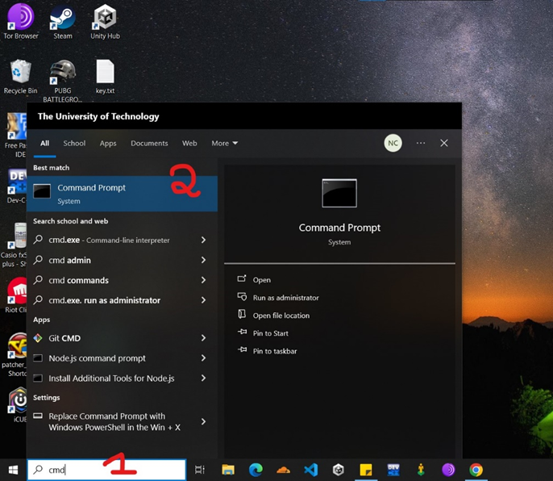
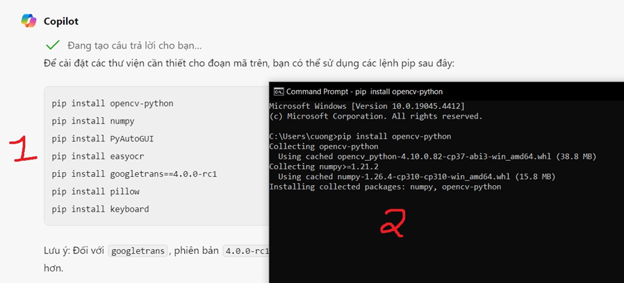
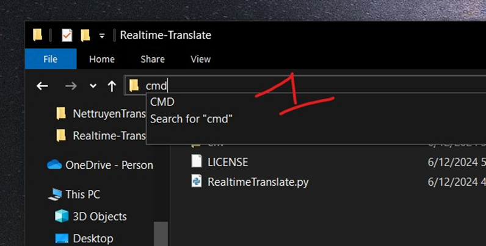
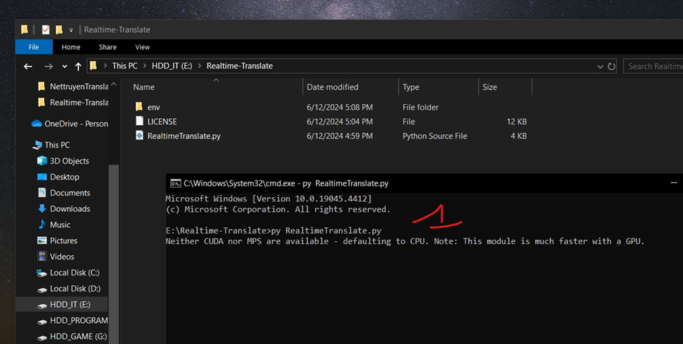
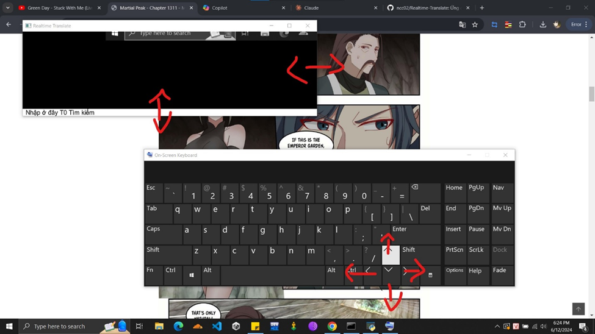
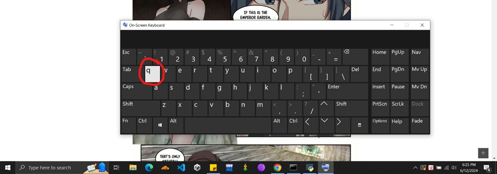

Hướng dẫn cài đặt
Bước 1: Cài python 3.10 

Bước 2: Chạy CMD bằng cách gõ cmd vào search của win10

Bước 3: Cài các thư viện cho python
 

Chỉ cần copy lệnh sau và paste vào CMD:
pip install opencv-python numpy PyAutoGUI easyocr googletrans==4.0.0-rc1 pillow keyboard opencv-contrib-python

Bước 4: Mở CMD tại thư mục clone github
 

Gõ cmd vào đường link thư mục clone và bấm Enter
Bước 5: Chạy ứng dụng bằng lệnh
py RealtimeTranslate.py
 

Hướng dẫn sử dụng

Chức năng 1: Dịch bong bóng chat
-	Để dịch văn bản chúng ta cần đưa con trỏ chuột vào bong bóng chat cần dịch (lưu ý vùng dịch trục y sẽ từ đầu con trỏ hướng xuống dưới, còn trục x sẽ là cách đều 2 bên con trỏ)
-	Văn bản được dịch sẽ hiển thị phía dưới ứng dụng
  

Chức năng 2: Điều khiển vùng dịch 
-	Chúng ta có thể điều chỉnh cửa sổ dịch bằng các phím mũi tên trên bàn phím
 
 

Chức năng 3: Quit 
-	Tắt ứng dụng bằng cách nhấn phím q (hoặc sử dụng tổ hợp phím ctrl + c trong cmd)
 	 

Đọc thêm
-	Đây là ứng dụng mà mình dành 1 ngày 1 đêm để tạo ra, nếu các bạn thấy có ích đừng quên donate cho mình tại STK 5622099833 (BIDV) NGUYEN CONG CUONG để mình có động lực cải tiến cũng như nâng cấp trong tương lai xD

 
