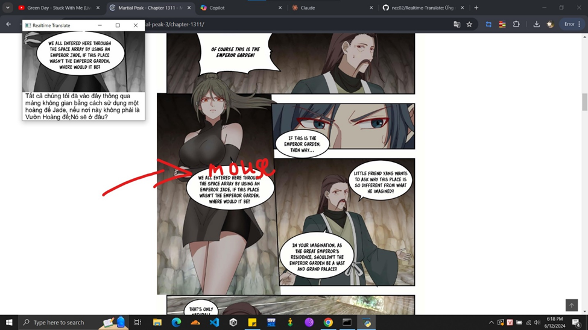
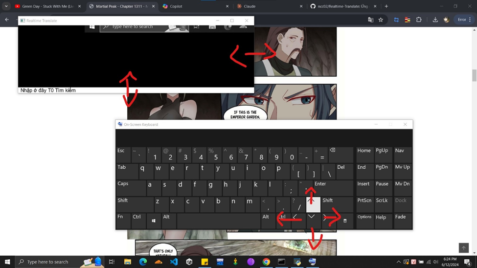
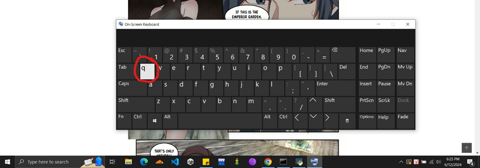

# Hướng dẫn sử dụng

Chức năng 1: Dịch bong bóng chat
-	Để dịch văn bản chúng ta cần đưa con trỏ chuột vào bong bóng chat cần dịch (lưu ý vùng dịch trục y sẽ từ đầu con trỏ hướng xuống dưới, còn trục x sẽ là cách đều 2 bên con trỏ)
-	Văn bản được dịch sẽ hiển thị phía dưới ứng dụng
-   Trong một số trường hợp nếu ứng dụng chỉ dịch các câu đầu trong đoạn văn thì chúng ta đưa con trỏ chuột xuống dưới các câu này để ứng dụng có thể dịch các câu tiếp theo trong đoạn (do model OCR nhận diện kém)
  

Chức năng 2: Điều khiển vùng dịch 
-	Chúng ta có thể điều chỉnh cửa sổ dịch bằng các phím mũi tên trên bàn phím
 
 

Chức năng 3: Quit 
-	Tắt ứng dụng bằng cách nhấn phím q (hoặc sử dụng tổ hợp phím ctrl + c trong cmd)
 	 

 
